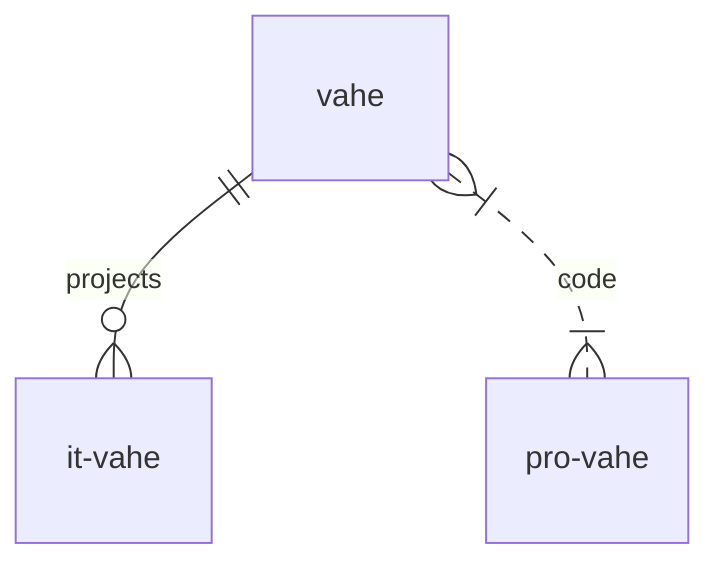

# Vahe
===========================

[](https://gitter.im/guodongxiaren/README?utm_source=badge&utm_medium=badge&utm_campaign=pr-badge&utm_content=badge)

|1|2|
|---|---
|1|[![zhihu-shield]][zhihu]
|2|2

#### diff

```diff
+ Добавил
- Удалил
! Внимание
# Коммент
```

<!-- TABLE OF CONTENTS -->
<details>
  <summary>Table of Contents</summary>
  <ol>
    <li>
      <a href="#about-the-project">About The Project</a>
      <ul>
        <li><a href="#built-with">Built With</a></li>
      </ul>
    </li>
    <li>
      <a href="#getting-started">Getting Started</a>
      <ul>
        <li><a href="#prerequisites">Prerequisites</a></li>
        <li><a href="#installation">Installation</a></li>
      </ul>
    </li>
    <li><a href="#usage">Usage</a></li>
    <li><a href="#roadmap">Roadmap</a></li>
    <li><a href="#contributing">Contributing</a></li>
    <li><a href="#license">License</a></li>
    <li><a href="#contact">Contact</a></li>
    <li><a href="#acknowledgments">Acknowledgments</a></li>
  </ol>
</details>

Содержание
1. [Ссылки](#links)
2. [table](#Таблица)
3. [Диаграмма](#diagram)

My-all-domains
-
## [index-page](https://vahe.ga/)
it-frontend-web-app-site-page-framework-component-dev-tool
-
[:arrow_up:Ссылки](#links)
### My all pet-projects
:white_check_mark: Это уже сделано  [vahe](https://vahe.ga/)

:white_check_mark: Это уже сделано  [app-vahe](https://app-vahe.ga/)
____
[:arrow_up:Таблица](#table)

| LEFT | CENTER | RIGHT |
|----------------|:---------:|----------------:|
| По левому краю | По центру | По правому краю |
| [it](https://it-vahe.ga/) | [vahe](https://vahe.ga/) | [app](https://www.app-vahe.ga/) |
____
[:arrow_up:Диаграмма](#diagram)


____

[:arrow_up:Диаграмма 2](#codeBlock)
>Textcode-pasttext：
