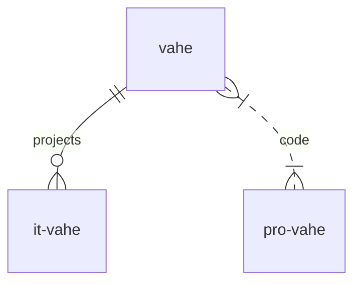

# Vahe

<!-- TABLE OF CONTENTS -->

  
Table of Contents

  <ol>
    <li>
      <a href="#about-the-project">About The Project</a>
      <ul>
        <li><a href="#built-with">Built With</a></li>
      </ul>
    </li>
    <li>
      <a href="#getting-started">Getting Started</a>
      <ul>
        <li><a href="#prerequisites">Prerequisites</a></li>
        <li><a href="#installation">Installation</a></li>
      </ul>
    </li>
    <li><a href="#usage">Usage</a></li>
    <li><a href="#roadmap">Roadmap</a></li>
    <li><a href="#contributing">Contributing</a></li>
    <li><a href="#license">License</a></li>
    <li><a href="#contact">Contact</a></li>
    <li><a href="#acknowledgments">Acknowledgments</a></li>
  </ol>

Содержание
1. [Ссылки](#links)
2. [table](#Таблица)
3. [Диаграмма](#diagram)

My-all-domains
-
## [index-page](https://vahe.ga/)
it-frontend-web-app-site-page-framework-component-dev-tool
-
[:arrow_up:Ссылки](#links)
### My all pet-projects
:white_check_mark: Это уже сделано  [vahe](https://vahe.ga/)

:white_check_mark: Это уже сделано  [app-vahe](https://app-vahe.ga/)
____
[:arrow_up:Таблица](#table)

| LEFT | CENTER | RIGHT |
|----------------|:---------:|----------------:|
| По левому краю | По центру | По правому краю |
| [it](https://it-vahe.ga/) | [vahe](https://vahe.ga/) | [app](https://www.app-vahe.ga/) |
____
[:arrow_up:Диаграмма](#diagram)

____
[:arrow_up:Диаграмма 2](#diagram2)

flowchart LR

A[Hard] -->|Text| B(Round)
B --> C{Decision}
C -->|One| D[Result 1]
C -->|Two| E[Result 2]

____
[:arrow_up:Диаграмма 3](#diagram3)

sequenceDiagram
Alice->>John: Hello John, how are you?
loop Healthcheck
    John->>John: Fight against hypochondria
end
Note right of John: Rational thoughts!
John-->>Alice: Great!
John->>Bob: How about you?
Bob-->>John: Jolly good!

____
[:arrow_up:Диаграмма 4](#diagram4)

flowchart TB
node1[Форма 1]  
node2(Форма 2)
node3([Форма 3])
node4[[Форма 4]]
node5[(Форма 5)]
node6((Форма 6))
node7>Форма 7]
node8{Форма 8}
node9{{Форма 9}}
node10[/Форма 10/]
node11[\Форма 11\]
node12[/Форма 12\]
node13[\Форма 13/]

____
[:arrow_up:Диаграмма 4](#diagram4)

pie title Pets adopted by volunteers
"Dogs" : 386
"Cats" : 85
"Rats" : 15
