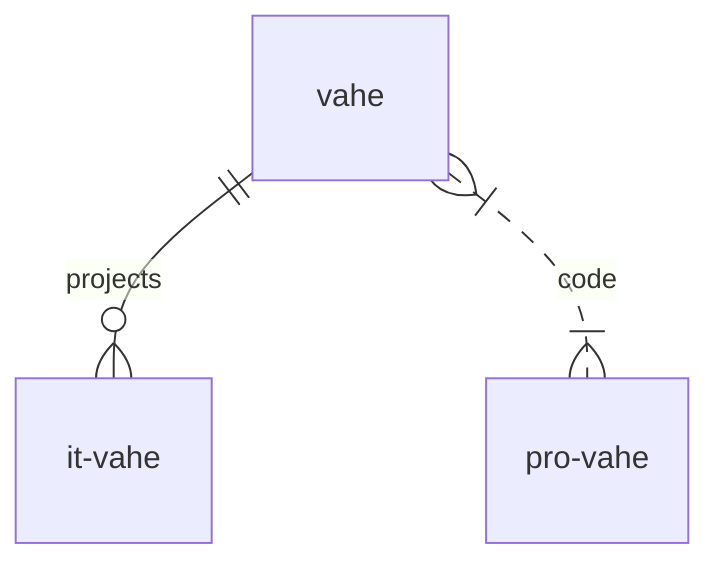

# Vahe
Содержание
1. [Ссылки](#links)
2. [table](#Таблица)
3. [Диаграмма](#diagram)

My-all-domains
-
## [index-page](https://vahe.ga/)
it-frontend-web-app-site-page-framework-component-dev-tool
-
[:arrow_up:Ссылки](#links)
### My all pet-projects
:white_check_mark: Это уже сделано  [vahe](https://vahe.ga/)

:white_check_mark: Это уже сделано  [app-vahe](https://app-vahe.ga/)
____
[:arrow_up:Таблица](#table)

| LEFT | CENTER | RIGHT |
|----------------|:---------:|----------------:|
| По левому краю | По центру | По правому краю |
| [it](https://it-vahe.ga/) | [vahe](https://vahe.ga/) | [app](https://www.app-vahe.ga/) |
____
[:arrow_up:Диаграмма](#diagram)

____
[:arrow_up:Диаграмма 2](#diagram2)

flowchart LR

A[Hard] -->|Text| B(Round)
B --> C{Decision}
C -->|One| D[Result 1]
C -->|Two| E[Result 2]

____
[:arrow_up:Диаграмма 3](#diagram3)

graph TD
A[This is an <b>important</b> <a href='https://google.com'>link</a>]

____
[:arrow_up:Диаграмма 4](#diagram4)

flowchart TB
node1[Форма 1]  
node2(Форма 2)
node3([Форма 3])
node4[[Форма 4]]
node5[(Форма 5)]
node6((Форма 6))
node7>Форма 7]
node8{Форма 8}
node9{{Форма 9}}
node10[/Форма 10/]
node11[\Форма 11\]
node12[/Форма 12\]
node13[\Форма 13/]

____
[:arrow_up:Диаграмма 4](#diagram4)

pie title Pets adopted by volunteers
"Dogs" : 386
"Cats" : 85
"Rats" : 15
